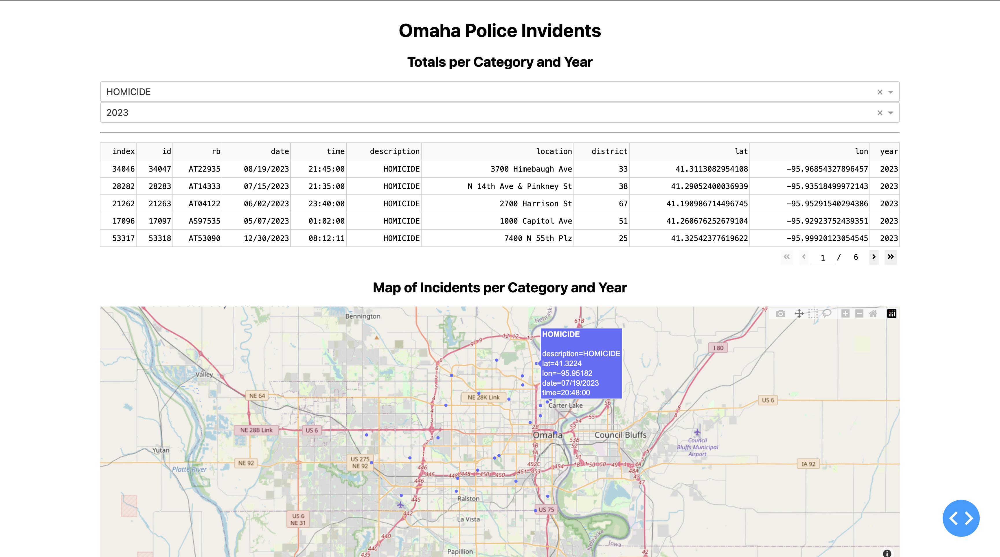

# Omaha Incidents

Data from the Omaha police department, used to analyze and visualize statistics.

## TODO

- [x] Import script
- [ ] Remove duplicate instances of headers being inserted into the database as records
- [ ] Explore & analyze the data 
- [ ] Plotly Dash visualizations
- [ ] Build API to connect to database?

## API

For the time being, you can explore the database via API with
[sqlite2rest](https://github.com/nside/sqlite2rest):

```sh
pip3 install sqlite2rest
sqlite2rest serve ./raw_data/ingress.db
```

## Screenshots


